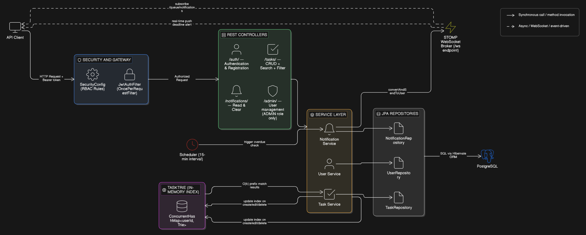

# TaskFlow Backend

A production-ready Spring Boot 3 (Java 21) backend for a task management application. It exposes secure REST APIs and WebSocket endpoints for managing users, tasks, and notifications.

---

## Key Features

- JWT-based authentication and authorization
- Role-based access control (`USER`, `ADMIN`)
- Task CRUD with sorting, filtering, and search
- WebSocket/STOMP notifications for task lifecycle and upcoming deadlines
- Scheduled jobs that periodically check task deadlines
- PostgreSQL persistence with JPA/Hibernate

---

## System Architecture Diagram

The TaskFlow system architecture is shown below:

---

## Tech Stack

- **Language**: Java 21  
- **Framework**: Spring Boot 3.5.3  
- **Core modules**:
  - `spring-boot-starter-web` - REST API
  - `spring-boot-starter-data-jpa` - ORM/JPA with Hibernate
  - `spring-boot-starter-security` - security & authentication
  - `spring-boot-starter-websocket` - STOMP/WebSocket messaging
- **Database**: PostgreSQL  
- **Build**: Maven, Spring Boot Maven Plugin (with `mvnw` wrapper)  
- **Other**: Lombok, Spring Scheduling (`@Scheduled`)

---

## Getting Started

### Prerequisites

- Java 21
- Maven (or the bundled `mvnw` / `mvnw.cmd`)
- PostgreSQL instance

### Configuration

Update `src/main/resources/application.properties` with your environment values, for example:

- `spring.datasource.url` - JDBC URL for your PostgreSQL database  
- `spring.datasource.username` / `spring.datasource.password`  
- `server.port` - HTTP port (default: `8081`)  
- `jwt.secret` - Base64-encoded secret key  
- `jwt.expiration` - token lifetime in milliseconds  

### Run the Application

From the project root:

- Linux/macOS: `./mvnw spring-boot:run`  
- Windows: `mvnw.cmd spring-boot:run`  

The backend starts at `http://localhost:8081`.

---

## API Overview (High Level)

- **Authentication**
  - `POST /auth/register` - register a new user and receive a JWT
  - `POST /auth/login` - authenticate and receive a JWT
- **Tasks (user scope)**
  - `/task/**` - create, update, delete, list, and search tasks for the authenticated user
- **Admin**
  - `/task/admin/**` - manage all tasks and users
- **Notifications**
  - `/notification/**` - trigger and consume task notifications
- **WebSocket/STOMP**
  - Connect to `/ws`, send messages to `/app/**`, and subscribe to `/user/queue/notifications`

For detailed request/response bodies, see the controller and DTO classes under `src/main/java/com/taskflow`.

---

## Running Tests

- Linux/macOS: `./mvnw test`  
- Windows: `mvnw.cmd test`  

This runs the existing Spring Boot tests; you can extend coverage with additional service and controller tests as needed.
